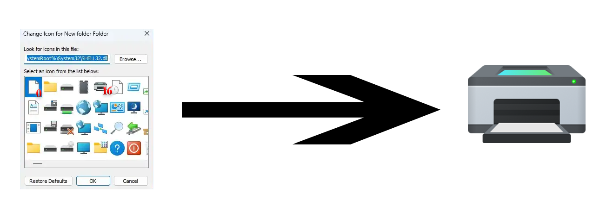
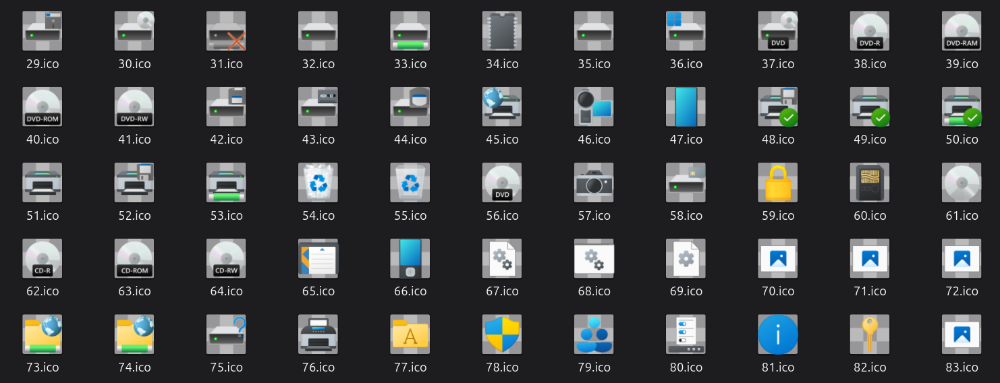

<div align="center">

# ico-extract

[](https://www.rust-lang.org/)
[](https://webassembly.org/)
[](https://github.com/goddivor/ico-extract/releases)
[](./LICENSE)
[](https://www.npmjs.com/package/ico-extract)

[](https://github.com/goddivor/ico-extract/stargazers)
[](https://github.com/goddivor/ico-extract/network/members)
[](https://github.com/goddivor/ico-extract/watchers)
[](https://github.com/goddivor/ico-extract/graphs/contributors)
[](https://github.com/goddivor/ico-extract/issues)

Extract icons (`.ico`) from Windows PE files (`.dll` / `.exe`).

</div>

A small, dependency-free **Rust** PE parser that reads the `RT_GROUP_ICON` /
`RT_ICON` resources of a Windows executable and reassembles a standard `.ico`
file. It does **not** call any OS API; it just parses the file format, so it
runs on **any platform** and compiles to **WebAssembly** for use from Node.js.

Typical use: pull the native folder icon out of `imageres.dll` /
`shell32.dll`, no Windows tooling (Resource Hacker, PowerShell) required.

> **Windows 10/11 note:** stock icons are no longer stored in the `.dll`
> itself but in a matching `.mun` file under
> `C:\Windows\SystemResources\` (e.g. `imageres.dll.mun`). A `.mun` is a
> regular PE, so point the extractor at it. For example, the generic folder
> icon is resource id **4** in `imageres.dll.mun`.

## 🤔 Why

Windows embeds its stock icons inside DLLs as PE resources. Reading them is pure
byte parsing of a documented format (PE → `.rsrc` directory tree → icon
groups), not an OS feature, so it can be done portably and shipped as a single
`.wasm` artifact on npm.

## 📦 Install

```bash
npm i ico-extract
```

## 🖥️ CLI: extracting icons from a DLL / EXE / MUN

Two runnable examples ship with the crate (no install, just `cargo run`).

### `extract`: inspect a file or pull one group

Run it with only a file path to **list** the icon groups it contains:

```bash
cargo run --example extract -- /home/user/icons/imageres.dll.mun
# -> prints the number of groups and their Windows ids
```

Pass an index and an output path to **write** one group as a `.ico`:

```bash
# extract -- <file> [group_index] [out.ico]
cargo run --example extract -- /home/user/icons/shell32.dll.mun 16 /home/user/icons/printer.ico
```

> ⚠️ `[group_index]` is the **position in the list** (0-based), *not* the Windows
> resource id. Defaults to `0` and `out.ico` when omitted.



### `extract-all`: dump every group at once

Writes one `<id>.ico` per group into a directory (named by Windows resource id):

```bash
cargo run --example extract-all -- /home/user/icons/imageres.dll.mun /home/user/icons/icons-imageres
```



### Quiet mode

Add `-q` (or `--quiet`) right after `--` to silence success output (errors still
print to stderr and set a non-zero exit code):

```bash
cargo run --example extract-all -- -q /home/user/icons/imageres.dll.mun /home/user/icons/
```

> **Windows 10/11 reminder:** plain `.dll` files no longer carry their icons, so
> running these on `shell32.dll` / `imageres.dll` directly often yields **0
> groups**. Windows moved the resources into companion `.mun` files (under
> `C:\Windows\SystemResources\`) referenced by the DLLs; point the extractor at
> the `.mun` instead.

## 🧩 Usage as a package (Node.js)

The WASM build exports three functions:

```js
import { listIconGroups, extractIcon, extractIconById } from 'ico-extract';
```

| Function | Signature | Returns |
| -------- | --------- | ------- |
| `listIconGroups(peBytes)` | `(Uint8Array) => Uint32Array` | the Windows ids of every icon group |
| `extractIcon(peBytes, index)` | `(Uint8Array, number) => Uint8Array` | `.ico` bytes of the group at that **position** (0-based) |
| `extractIconById(peBytes, id)` | `(Uint8Array, number) => Uint8Array` | `.ico` bytes of the group with that **Windows id** |

> **The WASM module never reads the disk.** Your code is responsible for loading
> the file and passing the raw bytes; a Node `Buffer` is accepted as-is (it is a
> `Uint8Array`). This also means it works on a `.dll` copied from another machine.

```js
import { extractIconById, listIconGroups } from 'ico-extract';
import fs from 'fs';

// 1. Node reads the file (a .mun, .dll or .exe); the WASM never touches disk.
const pe = fs.readFileSync('/home/user/icons/imageres.dll.mun');

// 2. List the groups (optional).
const ids = listIconGroups(pe);          // Uint32Array, e.g. [..., 4, ...]
console.log('groups:', ids.length);

// 3. Extract the generic folder icon (id 4) as a .ico.
const ico = Buffer.from(extractIconById(pe, 4));
fs.writeFileSync('folder.ico', ico);     // valid multi-size Windows .ico
```

## 🔧 Build from source

Requires the Rust toolchain and [`wasm-pack`](https://rustwasm.github.io/wasm-pack/).

```bash
# native tests (no wasm needed)
cargo test

# build the npm/WASM package into pkg/
rustup target add wasm32-unknown-unknown
cargo install wasm-pack
npm run build        # -> pkg/  (publish that directory)
```

The native library has **zero dependencies**; `wasm-bindgen` is pulled in only
for the optional `wasm` feature used by `wasm-pack`.

## 📄 License

MIT
